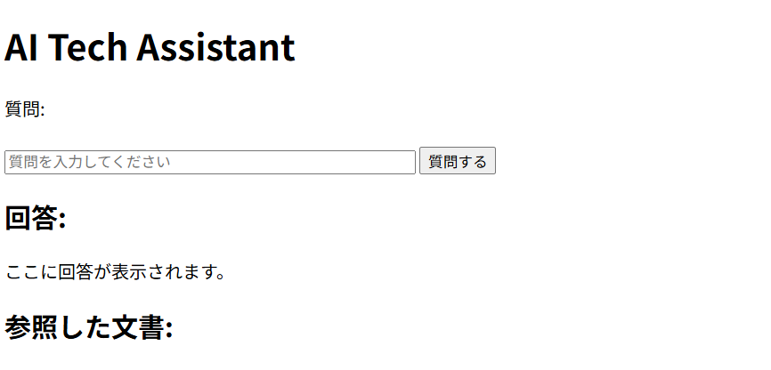
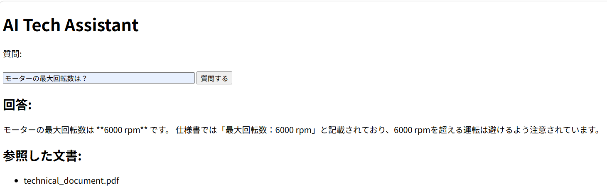
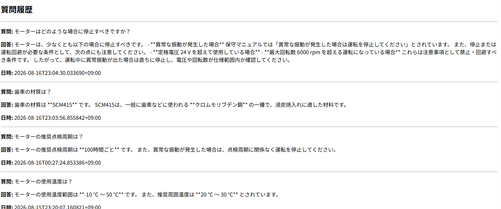

# AI Technical Assistant

Technical documentation AI assistant using OpenAI API, File Search, FastAPI, and SQLite.

## Overview

AI Technical Assistant is a web-based AI application that allows users to ask questions about technical documents.

The application uses OpenAI File Search to retrieve relevant information from technical documents and generates answers based on the retrieved content.

The system also displays the source documents used for the answer and stores question and answer history in SQLite.

The application provides a simple Web UI and can be run in a Docker container.

## Features

* Ask questions about technical documents
* Web-based user interface
* Search documents using OpenAI File Search
* Generate answers using OpenAI Responses API
* Display source documents used for the answer
* Store question and answer history in SQLite
* Display question and answer history
* Validate empty questions
* Handle API and application errors
* Log token usage for each request
* Run the application with Docker

## System Architecture

```text
User
  │
  ▼
Web UI
  │
  ▼
FastAPI
  │
  ├── /ask
  │     │
  │     ▼
  │   OpenAI Responses API
  │     │
  │     ├── File Search
  │     │      │
  │     │      ▼
  │     │   Vector Store
  │     │      │
  │     │      ▼
  │     │   Technical Documents
  │     │
  │     ▼
  │   AI-generated Answer
  │
  └── /history
         │
         ▼
      SQLite

Web UI displays:
  ├── AI-generated Answer
  ├── Source Documents
  └── Question & Answer History

```

## Technologies

| Technology         | Purpose                              |
| ------------------ | ------------------------------------ |
| Python             | Application development              |
| FastAPI            | REST API and Web application backend |
| HTML / CSS / JavaScript | Web UI                          |
| OpenAI API         | AI response generation               |
| OpenAI File Search | Technical document search            |
| Vector Store       | Storage for searchable document data |
| SQLite             | Question and answer history          |
| Docker             | Application containerization         |
| Git / GitHub       | Version control                      |

## Project Structure

```text
ai-tech-assistant/
│
├── app/
│   ├── __init__.py
│   ├── database.py
│   └── main.py
│
├── documents/
│   ├── .gitkeep
│   └── technical_document.pdf
│
├── tests/
│   └── .gitkeep
│
├── data/
│   └── .gitkeep
│
├── Dockerfile
├── requirements.txt
├── upload_file.py
├── test_database.py
├── test_file_search.py
├── test_openai.py
├── .dockerignore
├── .gitignore
└── README.md
```


## Web UI

The application provides a simple Web UI for interacting with the AI Technical Assistant.

Users can:

* Enter questions about technical documents
* View AI-generated answers
* View source documents used for the answer
* View previous question and answer history
* Receive error messages for invalid input or application errors

The Web UI communicates with the FastAPI backend.

## RAG and Source Documents

The application uses OpenAI File Search to search technical documents stored in a Vector Store.

When a user asks a question, relevant information is retrieved from the technical documents and provided to the AI model.

The application also retrieves the source document information and displays it in the Web UI.

This allows users to verify which technical document was used as the basis for the AI-generated answer.

## API Endpoints

### POST `/ask`

Send a question to the AI assistant.

Example response:

```json
{
  "answer": "モーターの最大回転数は6000rpmです。",
  "sources": [
    {
      "file_name": "technical_document.pdf"
    }
  ]
}
```

The API returns the question, AI-generated answer, source documents, model information, and token usage.


### GET `/history`

Returns previously stored questions and answers from the SQLite database.

## Database

The application uses SQLite to store question and answer history.

The history is stored in:

```text
data/history.db
```

The `questions` table contains:

```text
id
question
answer
created_at
```

Questions and answers are stored automatically when `/ask` successfully generates a response.

## Error Handling

The application validates user input before sending the request to OpenAI.

For example, an empty question returns:

```text
HTTP 400 Bad Request
```

Unexpected errors during AI processing return:

```text
HTTP 500 Internal Server Error
```

## Environment Variables

Create a `.env` file in the project root.

```text
OPENAI_API_KEY=your_api_key
VECTOR_STORE_ID=your_vector_store_id
```

Do not commit the `.env` file to GitHub.

## Local Setup

### 1. Clone the repository

```bash
git clone <your-repository-url>
cd ai-tech-assistant
```

### 2. Create a virtual environment

```bash
python -m venv .venv
```

### 3. Activate the virtual environment

Windows Git Bash:

```bash
source .venv/Scripts/activate
```

### 4. Install dependencies

```bash
pip install -r requirements.txt
```

### 5. Configure environment variables

Create a `.env` file and add:

```text
OPENAI_API_KEY=your_api_key
VECTOR_STORE_ID=your_vector_store_id
```

### 6. Start the application

```bash
uvicorn app.main:app --reload
```

The API documentation is available at:

```text
http://127.0.0.1:8000/docs
```

## Run with Docker

Build the Docker image:

```bash
docker build -t ai-tech-assistant .
```

Run the container:

```bash
BMSYS_NO_PATHCONV=1 docker run -p 8000:8000 --env-file .env -v "$(pwd -W)/data:/app/data" -v "$(pwd -W)/documents:/app/documents" ai-tech-assistant
```

The Docker container uses volume mounts to persist SQLite history data and access technical documents from the host machine.

- `data/` → `/app/data`
- `documents/` → `/app/documents`

Then open:

```text
http://127.0.0.1:8000/
```

## Example

A user asks:

```text
モーターの最大回転数は何rpmですか？
```

The AI searches the technical documents using File Search and generates an answer based on the retrieved information.

The Web UI displays both the AI-generated answer and the source document used for the answer.

The question and answer are then stored in SQLite and displayed in the question history.

## Screenshots

### Web UI



### RAG Source Display



### Question History



## Future Improvements

Possible future improvements include:

* Automatic synchronization of documents in the Vector Store
* Prevention of duplicate document registration
* Support for additional document formats
* More comprehensive automated tests
* Improved Web UI design
* User authentication and access control

## Project Goal

This project was developed as a practical exercise in building an AI-powered technical document assistant.

The project covers the development flow from API development and database integration to RAG-based document search, Web UI development, error handling, and Docker containerization.

The goal is to build a practical AI application that can be used to search technical documents, provide answers with source information, and maintain question and answer history.
